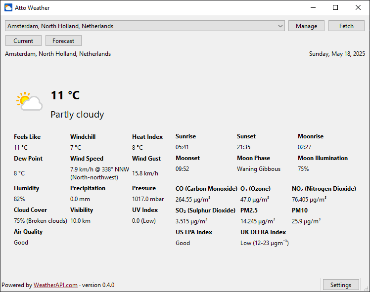

# Atto Weather

A weather app written using PySide6.



## Features

- Current weather information from dozens of locations
- 3-day weather forecast with 24-hour details
- Air quality & astronomy details

*Weather data and icons courtesy of [WeatherAPI]*

## Building

No executable builds of Atto Weather are currently available.

Clone this repository.

```sh
git clone https://github.com/aescarias/atto-weather
cd atto-weather
```

Create a virtual environment (Python 3.9 or later).

```sh
python -m venv .venv --prompt atto # make sure you use the right version!

# then
source .venv/bin/activate # on Unix likes
# or
.venv/Scripts/activate # on Windows
```

Once inside, install the required dependencies and run the application.

```sh
python -m pip install -e .
python -m atto_weather
```

## Setup

Atto Weather uses [WeatherAPI] to provide its weather data. To use this service, you must acquire an API key. To do so, create an account at [WeatherAPI] then copy the "API Key" from the Dashboard. Enter this key into the prompt you see when first opening the app.

[WeatherAPI]: https://weatherapi.com
